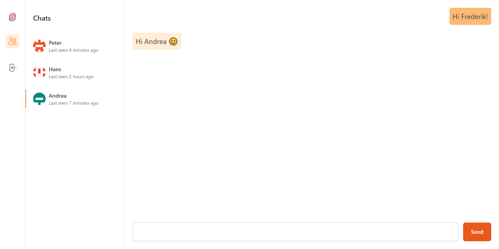

## Svelte chat app
Simple chat app, built using SvelteKit.



### Technologies
- SvelteKit
- Tailwind CSS

### What can it do?
The application allows you to chat with any user on the system. It was my first experiment with Svelte and not really an actual application. Hence the lack of authentication, web sockets, etc.

### Installation
To link the application with you Vercel PostgreSQL database, run the follwing commands:
[Read more](https://vercel.com/docs/cli)
```
pnpm i -g vercel
vercel link
vercel env pull .env.development.local
```
